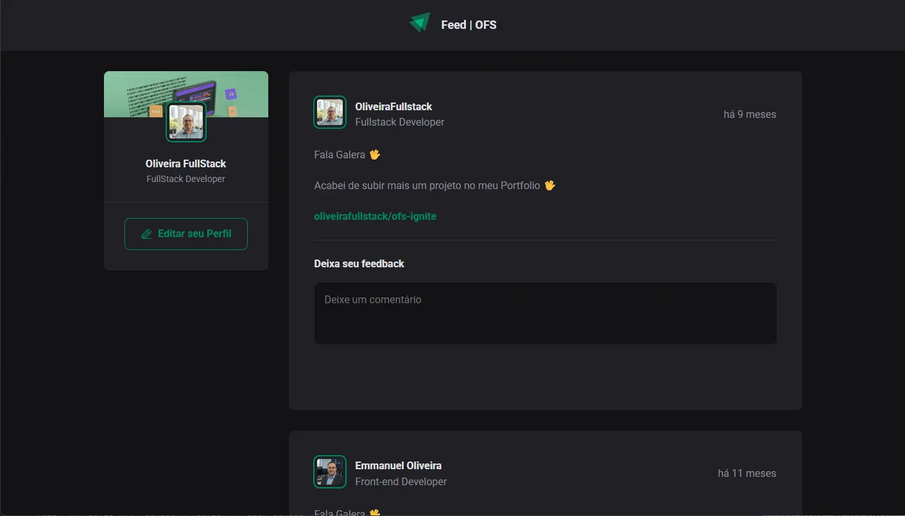

<div align="center">

# OFS Feeds


## </div>

## 📋 Menu

- 🖼️ [Imagem do Projeto](#imagem-do-projeto)
- 📖 [Sobre](#sobre)
- 🛠️ [Tecnologias](#tecnologias)
- ⚙️ [Funcionalidades](#funcionalidades)
- 🗂️ [Arquitetura de Dados](#arquitetura-de-dados)
- 📁 [Estrutura do Projeto](#estrutura-do-projeto)
- 🚀 [Configuração](#configuração)
- 🗺️ [Rotas](#rotas)
- 👥 [Contributors](#contributors-or-owners)
- 🤝 [Contribuir](#contribute-to-the-projects-or-owner)
- 📬 [Contact](#contact)
- 📄 [License](#license)


<div align="center">

## Imagem do Projeto


</div>

## Sobre

OFS Feeds é um projeto frontend desenvolvido em React + TypeScript, utilizando Vite para o ambiente de desenvolvimento moderno e rápido. O objetivo é simular um feed de publicações, semelhante a redes sociais, com foco em boas práticas de componentes, estilização com CSS Modules e manipulação de dados em memória.

| Item                | Detalhe                                  |
| ------------------- | ---------------------------------------- |
| Tipo de repositório | Monolito                                 |
| Estrutura           | Vite SPA standalone                      |

Desenvolvido por **Emmanuel Oliveira**.

## Tecnologias

| Tecnologia              | Versão    | Descrição                                 |
| ----------------------- | --------- | ----------------------------------------- |
| React                   | ^19.2.6   | Biblioteca principal de UI                |
| TypeScript              | ~6.0.2    | Tipagem estática                          |
| Vite                    | ^8.0.12   | Bundler e ambiente de desenvolvimento     |
| @phosphor-icons/react   | ^2.1.10   | Ícones para interface                     |
| date-fns                | ^4.4.0    | Manipulação de datas                      |
| @biomejs/biome          | 2.4.16    | Linter e formatter                        |

## Funcionalidades

- Visualização de posts simulados
- Componente de comentários
- Sidebar com informações do usuário
- Estilização com CSS Modules

## Arquitetura de Dados

Estrutura dos posts:

```ts
type PostType = {
  id: number;
  author: {
    avatarUrl: string;
    name: string;
    role: string;
  };
  content: Array<{
    type: 'paragraph' | 'link';
    content: string;
    href?: string;
  }>;
  publishedAt: Date;
};
```

## Estrutura do Projeto

```
src/
  app.tsx
  main.tsx
  assets/
    svg/
  components/
    avatar/
    comment/
    core/
      container/
    header/
    post/
    sidebar/
  styles/
    index.css
  utils/
    posts.ts
public/
  thumb.png (adicione uma imagem de capa do projeto aqui)
```

## Configuração

1. Instale as dependências:
   ```sh
   pnpm install
   ```
2. Rode o projeto em modo desenvolvimento:
   ```sh
   pnpm dev
   ```
3. Acesse em [http://localhost:5173](http://localhost:5173)

## Rotas

SPA — apenas rota principal `/`.

## Contributors
`Pull requests são bem-vindos! Siga o padrão de código e abra uma issue para discutir mudanças.`


<br>


[Emmanuel Oliveira](https://www.linkedin.com/in/oliveira-emmanuel/)


<br>

<small>

[developed by 💖Emmanuel Oliveira](https://www.linkedin.com/feed/?trk=homepage-basic_sign-in-submit)

</small>

<br>

&copy; Todos os Direitos Reservados


## Contribute to the projects or Owner
  
Clique na seta abaixo e veja como você pode contribuir para o projeto


<details close>

<summary>
Como fazer uma contribuição ao Projeto ?
</summary>
 Familiarize-se com a documentação do projeto, que geralmente inclui guias de instalação.

 <br>

Explore o código do projeto para entender sua estrutura e funcionamento.

<br>

**Faça um Fork**

Crie uma cópia (fork) do repositório original em sua conta do GitHub.

<br> 


<a href="https://docs.github.com/pt/pull-requests/collaborating-with-pull-requests/working-with-forks/fork-a-repo"></a>
  

**Clone o Repositório**
  
Isso criará uma cópia local do projeto, onde você poderá fazer suas modificações.


<a href="https://docs.github.com/pt/repositories/creating-and-managing-repositories/cloning-a-repository"></a>
  
**Crie uma Nova Branch:**

  Crie uma nova branch para isolar suas alterações.

  <br>

Isso facilita a organização do seu trabalho e a criação de pull requests.

<br>  

**Faça as Alterações:**

  

Crie funcionalidades, mude estilos ou resolva `bugs` que iram contribuir para a melhoria do Projeto.

<br>

 **Crie um Pull Request:**
  
Inclua uma descrição clara das suas alterações e explique como elas resolvem o problema ou melhoram o projeto.<br>

Solicitação: Envie um pull request para o repositório original, solicitando que suas alterações sejam incorporadas ao projeto.

 <br>

  
**Revise e Responda a Feedback:**

  Colabore: Os mantenedores do projeto podem solicitar alterações ou fornecer feedback sobre o seu código.

  </details>

## Contact

[](https://www.linkedin.com/in/oliveira-emmanuel/)
[](https://wa.me/5511968336094)
<a href="mailto:ofs.dev.br@gmail.com"> </a>  

<sub>😁Obrigado por chegar até aqui!<sub>

  
## License

<br>
Released in 2026 This project is under the **MIT license**<br>

<br> 
<div align="center">
<strong>⭐ Se este projeto foi útil para você, considere dar uma estrela!</strong> 
</div>


Caso julge importante acrescentar algo que faça uma pergunta
